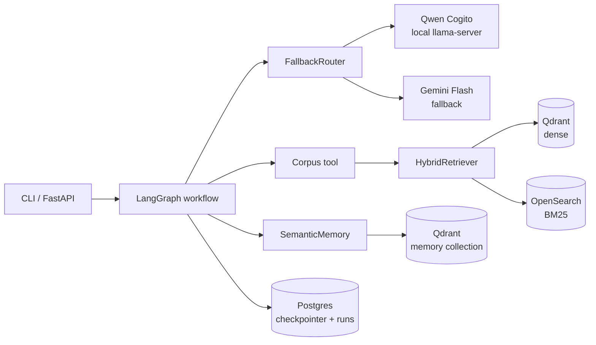
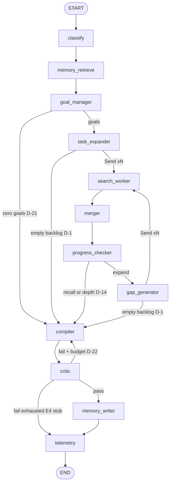
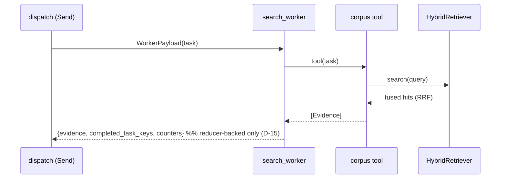
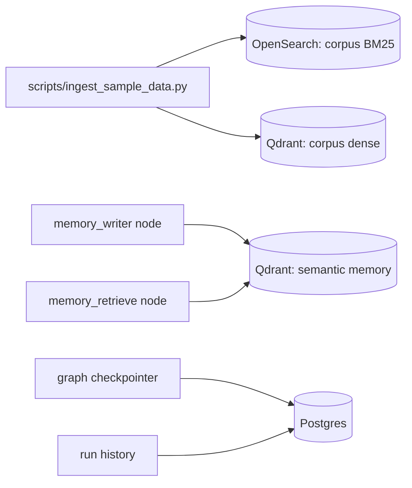

# Agentic Research Agent — Reference Implementation (Core Build)

A production-*style* (not production-*grade*) research agent built on LangGraph,
designed as a learning vehicle and engineering showcase. Given a research
question, it plans goals, retrieves evidence in parallel, iteratively deepens
coverage, self-critiques its report, and remembers what it learned for future
runs.

> **Status:** Core build. Implements the workflow graph, hybrid retrieval,
> semantic memory, LLM fallback routing, and the self-critique loop from the
> accompanying design document (decisions D-1…D-24 subset). MCP tool
> mediation and human-in-the-loop interrupts are deliberately deferred —
> see [Limitations](#limitations).

## Overview

**Project goals**

1. Learn Agentic AI architecture hands-on.
2. Showcase engineering practice: bounded loops, concurrency-safe state,
   graceful degradation, honest telemetry.
3. Serve as a readable reference — every module explains *why*, not just *what*.

**Learning objectives** — after reading this codebase you should understand:
orchestration with LangGraph (nodes, edges, conditional routing, `Send`
fan-out), planning (goal decomposition, gap-driven iteration), tool calling,
hybrid retrieval (dense + BM25 + RRF), long-term memory with staleness decay,
self-evaluation, and provider fallback.

**Architecture summary** — a *workflow*, not a free-form agent: the graph
topology is fixed at build time; LLMs fill in content (goals, tasks, reports,
critiques) but never choose the control flow. That distinction is the single
most important concept here — dynamic agency is a different pattern, kept out
of this repo on purpose.

## Features

**Capabilities**
- Goal-driven research over an ingested corpus (hybrid dense+keyword search).
- Parallel retrieval fan-out with concurrency-safe state merging.
- Iterative gap-filling bounded by depth and recall targets.
- Bounded self-critique with grounded rewrites.
- Cross-run semantic memory with volatility-aware staleness decay.
- Primary→fallback LLM routing (local Qwen Cogito → Gemini Flash) with a
  quality threshold.
- Fully offline demo mode (`LLM_MODE=stub`) — the entire graph runs with zero
  services and zero API keys.

**Non-goals**
- Production deployment, auth, multi-tenancy, horizontal scaling.
- Dynamic (LLM-decided) control flow / supervisor agents.
- Web search — retrieval is over the local sample corpus.

## Architecture

### Overall architecture



### Agent workflow



### Request flow (one worker, simplified)



### Storage interactions



## Design

- **Orchestration** (`orchestration/`): the graph topology and routing live in
  `graph.py`; the worker return contract (`contracts.py`) turns a
  non-deterministic concurrency bug into a deterministic unit-test failure.
- **State** (`state.py`): every field parallel workers write carries a reducer.
  Read the reducer docstrings first — they are the concurrency model.
- **LLM routing** (`llm/`): one OpenAI-compatible client serves both providers;
  fallback policy lives in exactly one place (`router.py`).
- **Retrieval** (`retrieval/`, `storage/`, `tools/`): storage modules are
  policy-free wrappers; fusion math is a pure function; the tool translates
  hits into domain Evidence.
- **Memory** (`memory/`): similarity × volatility-decay reranking; memory items
  re-enter the graph as ordinary evidence, so every downstream rule (coverage,
  contradiction) treats memory and fresh sources identically.
- **Evaluation** (`evaluation/`): the self-scoring signal behind fallback.

## Project Structure

```
agentic-research-agent/
├── src/research_agent/
│   ├── config.py            # all tunables, validated, from .env
│   ├── state.py             # entities, graph state, reducers (read first)
│   ├── logging_setup.py     # JSON-lines structured logging
│   ├── llm/                 # client (real + stub) and fallback router
│   ├── prompts/             # every prompt, one place
│   ├── agents/              # node functions by phase: planning/gathering/compilation
│   ├── orchestration/       # graph wiring + worker contract enforcement
│   ├── retrieval/           # hybrid dense+BM25 with RRF (pure fusion fn)
│   ├── memory/              # semantic memory with decay
│   ├── storage/             # postgres / qdrant / opensearch wrappers
│   ├── tools/               # the corpus-search tool workers invoke
│   ├── evaluation/          # answer quality self-scoring
│   ├── api/server.py        # FastAPI wrapper
│   └── cli.py               # CLI entry + dependency assembly
├── tests/                   # offline: reducers, contracts, routing, e2e
├── scripts/ingest_sample_data.py
├── sample_data/corpus.jsonl # 10 docs, Redis-vs-Memcached theme
├── docker-compose.yml       # optional: postgres + qdrant + opensearch
├── requirements.txt  .env.example  run.bat
```

## Setup

Windows (PowerShell):

```powershell
# 1. Install
python -m venv .venv
.venv\Scripts\Activate.ps1
pip install -r requirements.txt

# 2. Configure
copy .env.example .env        # defaults run fully offline (LLM_MODE=stub)

# 3. First run — no services, no keys, deterministic
$env:PYTHONPATH = "src"
python -m research_agent.cli "Compare Redis and Memcached for session caching"

# Or simply:  run.bat
```

Linux/macOS:

```bash
# 1. Install
python3 -m venv .venv && source .venv/bin/activate
pip install -r requirements.txt

# 2. Configure
cp .env.example .env          # defaults run fully offline (LLM_MODE=stub)

# 3. First run — no services, no keys, deterministic
export PYTHONPATH=src
python -m research_agent.cli "Compare Redis and Memcached for session caching"

# 4. Tests
python -m pytest tests/ -q

# 5. Optional: real infrastructure + real retrieval
docker compose up -d
python scripts/ingest_sample_data.py

# 6. Optional: live LLMs — set in .env:
#    LLM_MODE=live, your llama-server URL/model, and a Gemini API key

# 7. Optional: HTTP interface
uvicorn research_agent.api.server:app --reload
```

## Walkthrough

1. **A request arrives** (CLI or API) → `build_app_and_settings()` wires every
   dependency, each storage module probing its service and degrading if absent.
2. **Plan**: `classify` labels the intent → `memory_retrieve` recalls related
   past evidence (decay-reranked) → `goal_manager` composes goals (memory hints
   included) → `task_expander` emits a ranked backlog capped at `MAX_FANOUT` —
   overflow is the *producer's* decision (D-13), so dispatch is always total.
3. **Gather (cyclic)**: `dispatch_tasks` fans one `Send` per task to
   `search_worker` instances that run in the same superstep; each returns only
   reducer-backed keys (enforced), recording success or failure-with-depth.
   `merger` flags contradictions; `progress_checker` computes quality-gated,
   contradiction-aware recall and ticks the depth counter. Below target and
   depth: `gap_generator` produces new tasks (dedup + failed-key rules applied)
   and the cycle repeats.
4. **Decisions**: the graph decides *where to go*; models decide *content*.
   Termination is guaranteed by four independent bounds: recall target, depth
   counter, empty-backlog fallthrough, recursion-limit backstop.
5. **Compile & critique**: the report is drafted, judged for faithfulness and
   completeness only, and rewritten against explicit notes up to
   `MAX_REVISIONS`; exhaustion logs the E4 escalation stub and ships the report
   marked unreviewed — never silently.
6. **Persist & learn**: a *passed* report's fresh evidence enters semantic
   memory; telemetry aggregates node-recorded counters; a run-history row lands
   in Postgres when available.

## Design Decisions

Decision IDs reference the full architecture document that precedes this build.

| ID | Decision | Why |
|---|---|---|
| D-1 | Empty backlog routes to the compiler | An empty `Send` list would silently halt the graph with no report |
| D-2 | Dedup key sets + replace-on-write backlog | Idempotent dispatch; finite task supply per depth |
| D-3/D-4 | Depth counter + configurable recall target (0.85) | Exact recall ≥ 1.0 degenerates to always-max-depth |
| D-5/D-15 | Reducer-backed worker fields + runtime whitelist | The collision only appears under parallel load — must be impossible, not tested-for |
| D-13 | Fan-out capped at the producers | Overflow is a ranking decision, not a dispatcher accident |
| D-14 | Two termination points: convergence (recall/depth) and dispatch (backlog) | The backlog is stale at convergence time; judge it where it's fresh |
| D-16 | Failed ≠ completed; retry at strictly greater depth | Transient backend errors must not permanently burn a query |
| D-17/D-18 | Quality-gated, contradiction-aware coverage | No recall=1.0 on junk; contested goals drive adjudication automatically |
| D-21 | Zero goals → explicit error report | Diagnosable beats silent |
| D-22 | Bounded critique, grounded rewrites, scoped to faithfulness | One judge per question; no blind retries |
| D-24 | Memory decay = rerank by volatility class, never an age filter | One TTL is wrong for both stable and volatile facts |
| — | Graceful degradation everywhere | First run must succeed on a bare laptop |
| — | Stub LLM mode | Deterministic offline demo + honest tests using real prompts/schemas |

## Limitations

- **MCP deferred**: tools are plain callables behind `tools/`; the calling
  pattern is MCP-shaped so the upgrade touches one module (design D-26).
- **HITL deferred**: escalation triggers E1/E4 are log-line stubs, not
  `interrupt()` pauses (design D-23/D-28).
- **Contradiction detection is minimal**: the machinery (contested goals block
  coverage) is fully wired; the detector only honors explicit markers. A
  semantic detector slots into `merger` without wiring changes.
- **Server-side hybrid fusion deferred**: RRF + decay run in Python here for
  readability; the design (D-27) moves both into Qdrant `FormulaQuery`.
- **Memory simplifications**: no supersession links, no per-item volatility
  classification (items default `semi_stable`), no garbage collection job.
- **Self-evaluated quality is optimistic**: catches broken output, not subtle
  errors; a judge model is the upgrade.
- **Single tool, single worker type**: typed specialists (D-25) arrive with MCP.

## Future Improvements

In rough priority order: MCP tool mediation with typed workers → HITL
interrupts for E1–E4 (checkpointer already in place) → server-side Qdrant
fusion/decay with payload indexes → semantic contradiction detection → memory
supersession + GC job → judge-model quality scoring → token-usage telemetry
from provider usage metadata.
